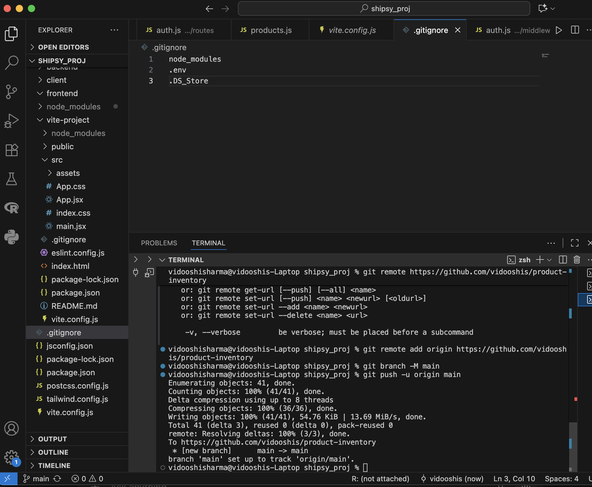
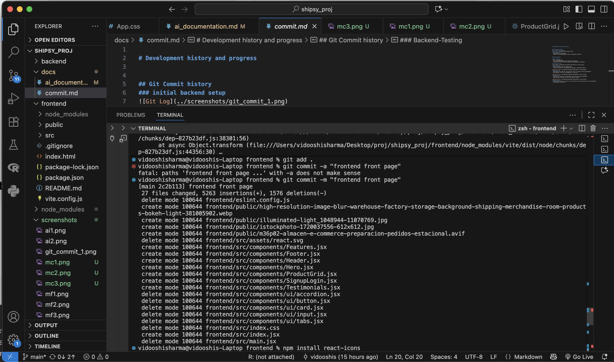
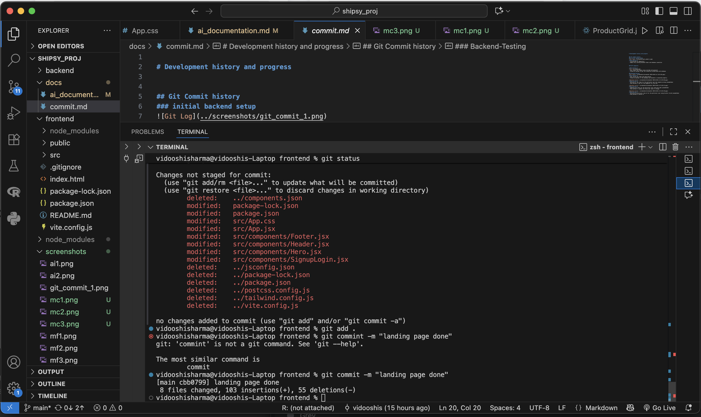
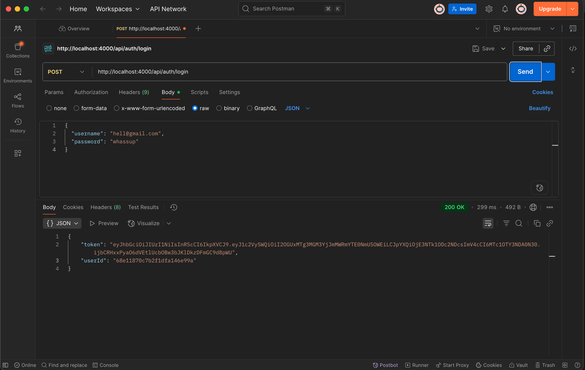

# Development history and progress

## Git Commit history
### initial backend setup

**Description:**
- Initialised Git Repository
- Added fully working backend folder and database connection

### commit with CLI, already have shared in ai_documentation

### initial frontend commit

- just the basic frontend with no styling, just the components 

### final landing page done

- commit after whole landing page was done with all the styling complete.

### API endpoints

**Description:**

- User signin and signup using username and password
- Tested on Postman to get the connection established with database

### Backend-Testing

**Description:**
- User saving the items with description
- Tested on postman if the database and backend is connected properly.

**Description:**
- Getting all the items for the particular user who signed up using jsonwebtoken
- Used postman to get all the endpoints for the user

**Description:**
- Updating the items for the particular user using the same jsonwebtoken
- Used postman to update the field user wants to change

**Description:**
- Deleting the particular item id for the particular user using his/her id and jsonwebtoken
- Used postman to delete it